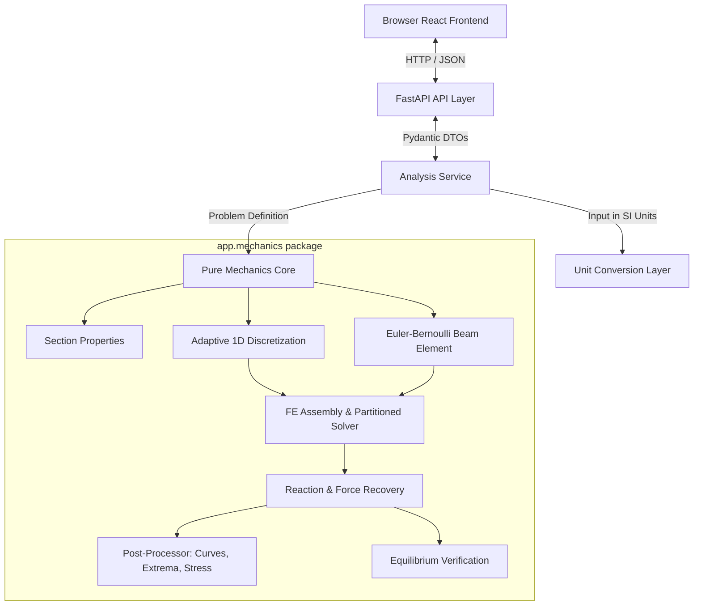

# Architecture Overview

This document details the software architecture, design principles, component boundaries, and data flow of the Interactive Mechanics Playground.

---

## 1. Architectural Principles

1. **Deterministic Mechanics Authority**:
   All engineering results (stiffness, displacements, rotations, reactions, internal shear and moment, bending stresses, section properties) are computed by deterministic analytical and numerical algorithms. Language models or non-deterministic algorithms have no authority over structural responses.

2. **Strict Decoupling of Domain Mechanics**:
   The `app.mechanics` package is an isolated, pure Python library with zero dependencies on FastAPI, Pydantic, HTTP transport, frontend libraries, or persistence layers. It depends only on standard mathematical libraries (`numpy`). This guarantees that:
   - The mechanics core can be tested directly from pytest or an interactive Python session without network or web overhead.
   - The mechanics core can be reused in future CLI tools, Python SDKs, Jupyter notebooks, or batch validation pipelines.

3. **Explicit Boundary Layers**:
   - **Frontend UI Layer**: Handles user interaction, input parsing, SVG rendering, and engineering charting.
   - **Transport / API Layer**: Validates incoming HTTP payloads via Pydantic, translates incoming units into canonical SI units, calls the analysis service, and formats JSON responses.
   - **Analysis Service Layer**: Coordinates domain models, drives mesh generation, invokes the finite-element solver, and extracts continuous field curves and extrema.
   - **Mechanics Core Layer**: Implements Euler-Bernoulli element equations, global stiffness assembly, constraint enforcement, partitioned linear solving, reaction recovery, and equilibrium verification.

---

## 2. Component Hierarchy Diagram

---

## 3. Package Responsibilities

### Backend (`backend/app/`)

- `api/routes.py`:
  Exposes REST endpoints (`POST /api/v1/analyze`, `GET /api/v1/examples`, `GET /health`). Manages HTTP status codes, error serialization, and Swagger OpenAPI schemas.

- `api/schemas.py`:
  Pydantic v2 data models defining the contractual schema for requests (beam geometry, loads, supports, sections, units) and responses (reactions, curve arrays, extrema, equilibrium status, warnings).

- `services/analysis_service.py`:
  Maps API DTOs into mechanics domain dataclasses, invokes unit conversions where needed, executes the mechanics solver, extracts output curves and extrema, and packages results into response DTOs.

- `mechanics/units.py`:
  Unit registry and conversion functions converting UI units (`mm`, `kN`, `MPa`, `in`, `kip`, etc.) to and from canonical SI units ($m, N, Pa, N\cdot m, m^4$).

- `mechanics/sections.py`:
  Computes second moment of area $I$ and neutral axis outer-fiber distance $c$ for standard geometric shapes (rectangular, circular) and custom user inputs.

- `mechanics/mesh.py`:
  Adaptive 1D discretization. Computes critical nodes at beam boundaries, supports, point loads, point moments, and distributed load interval boundaries, inserting intermediate nodes to ensure bounded element lengths for smooth plotting.

- `mechanics/element.py`:
  2-node Euler-Bernoulli cubic Hermite element. Computes local $4 \times 4$ element stiffness matrix $\mathbf{k}_e$ and consistent nodal load vector $\mathbf{f}_e$.

- `mechanics/solver.py`:
  Assembles global stiffness matrix $\mathbf{K}$ and global load vector $\mathbf{F}$. Enforces Dirichlet boundary conditions via partitioned submatrices. Solves unknown DOFs $\mathbf{d}_f = \mathbf{K}_{ff}^{-1} \mathbf{F}_f$, recovers support reactions $\mathbf{R}_c = \mathbf{K}_{cf} \mathbf{d}_f - \mathbf{F}_c$, and checks global equilibrium residuals.

- `mechanics/postprocessor.py`:
  Interpolates continuous deflection $v(x)$, rotation $\theta(x)$, shear force $V(x)$, bending moment $M(x)$, and outer-fiber bending stress $\sigma_x(x)$. Locates absolute and signed extrema.

### Frontend (`frontend/src/`)

- `components/BeamWorkspace/BeamSchematic.tsx`:
  Interactive SVG rendering of the beam line, visually distinct support symbols (Fixed, Pin, Roller), point load arrows with orientation, distributed load blocks, and dimension callouts.

- `components/PropertyPanel/`:
  Structured input panels for geometry, material properties, cross-sections, support table, and load table, with instant client-side validation.

- `components/ResultsArea/`:
  Engineering charts for $V(x)$, $M(x)$, $v(x)$, reaction badges, stress summary, and critical extrema tables.

- `services/api.ts`:
  Axios HTTP client configured via environment variable `VITE_API_URL` to facilitate independent deployment.

---

## 4. Architecture Decision Records (ADRs)

### ADR-001: 2-Node Hermite Cubic Euler-Bernoulli Beam Elements
- **Decision**: Use classical 2-node Euler-Bernoulli beam elements with cubic Hermite shape functions ($v, \theta$ per node).
- **Rationale**: For transverse bending without shear deformation, the exact homogeneous solution to the governing beam equation $EI \frac{d^4 v}{dx^4} = 0$ is a cubic polynomial. Hermite shape functions span this cubic space exactly. When nodes are placed at all point loads and distributed load boundaries, the nodal displacements and rotations are mathematically exact.
- **Alternatives Considered**: Timoshenko beam formulation (deferred to future version to maintain focus on classical bending), higher-order elements (unnecessary for 1D beam bending).

### ADR-002: Partitioned Submatrix Solver over Penalty Methods
- **Decision**: Enforce boundary conditions using degree-of-freedom partitioning ($\mathbf{K}_{ff}, \mathbf{K}_{fc}, \mathbf{K}_{cf}, \mathbf{K}_{cc}$).
- **Rationale**: Partitioning guarantees exact enforcement of zero displacements/rotations without introducing ill-conditioned numerical scaling (common with large penalty springs). Furthermore, reaction forces are recovered directly and precisely from original equilibrium equations: $\mathbf{R}_c = \mathbf{K}_{cf} \mathbf{d}_f - \mathbf{F}_c$.

### ADR-003: Internal SI Units with Independent Conversion Layer
- **Decision**: Core computations exclusively use SI base units ($m, N, Pa, m^4$).
- **Rationale**: Eliminates hidden conversion factors and dimensional bugs inside stiffness, load vector, and stress formulations.
