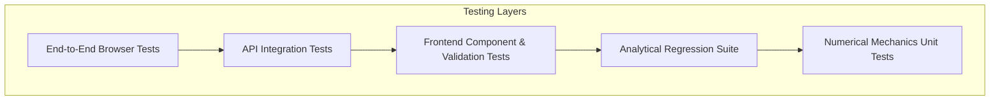

# Testing Strategy & Quality Assurance

This document details the multi-tiered automated testing architecture, testing conventions, and quality gates for the Interactive Mechanics Playground.

---

## 1. Testing Layers

The project implements automated verification across multiple complementary layers:



### 1. Numerical Mechanics Unit Tests (`backend/tests/test_*.py`)
- **Unit Conversion Tests**: Verify bidirectional conversions across all metric and US customary units.
- **Section Property Tests**: Verify rectangular and circular solid section area moments of inertia and outer-fiber distances against hand calculations.
- **Element Stiffness & Vector Tests**: Confirm $4 \times 4$ element stiffness matrix symmetry ($\mathbf{k} = \mathbf{k}^T$), positive semi-definiteness, zero-eigenvalue rigid-body modes, and consistent distributed load vectors.
- **Discretization Tests**: Ensure keypoint placement places nodes exactly at all loads, moments, and supports.

### 2. Analytical Regression Suite (`backend/tests/test_analytical_validation.py`)
- Validates the finite element solver against closed-form solutions for Cases A, B, C, and D.
- Evaluates reactions, peak bending moments, maximum deflections, and extreme bending stresses.
- Strictly asserts relative error $\le 10^{-5}$ and global equilibrium residual $< 10^{-9}$.

### 3. Stability & Error Handling Tests (`backend/tests/test_stability_errors.py`)
- Tests unconstrained configurations (0 supports, single pin support, roller-only unsupported spans).
- Confirms the solver raises descriptive `StructuralInstabilityError` instead of crashing with opaque matrix singularity errors.
- Tests invalid inputs: non-positive lengths, non-positive $E$, non-positive $I$, loads outside the beam span, inverted distributed load intervals.

### 4. API Integration Tests (`backend/tests/test_api.py`)
- Tests FastAPI endpoints (`/health`, `/api/v1/analyze`, `/api/v1/examples`).
- Verifies request schema validation, status codes (200, 422), response structures, and serializability.

### 5. Frontend Verification & Production Build
- Strict TypeScript compilation (`tsc --noEmit`).
- Production bundle verification (`npm run build`).
- Browser workflow verification following the `browser-ui-verification` skill.

---

## 2. Running Automated Tests

### Python Backend Suite
```bash
cd backend
pytest -v --tb=short
```

### Frontend Typecheck & Build
```bash
cd frontend
npm run typecheck
npm run build
```

---

## 3. Regression & Tolerance Policy

- Never increase floating-point tolerances to make a failing test pass.
- When an analytical test fails, systematically investigate:
  1. Analytical formula accuracy
  2. Sign convention consistency
  3. Boundary condition DOFs
  4. Nodal load vector integration
  5. Discretization refinement
- Any bug report must be paired with a reproducing test before fixing.
